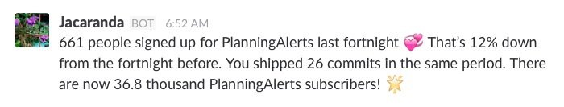

# Jacaranda

*A watchful tree and Slack messenger to keep you informed of the use of PlanningAlerts.*

Working on PlanningAlerts over the last year we’ve noticed that:

* We don’t have an accurate idea of the impact of PlanningAlerts, how many people are using it, or the rate a which this is changing; and
* We feel more energised in our work when we get feedback about it’s use and impact.

Jacaranda is an experiment to see the impact of regular feedback on the people developing PlanningAlerts. It aims to keep you more informed of the use and impact of PlanningAlerts; to remind you of the effort you’ve put in to achieve this; and to do this in an quick and unobtrusive way.

Jacaranda collects information about people using PlanningAlerts and the work we do to make it better for them. It then sends a short fortnightly message to our Slack channel to give us a sense of how things are going.



This is a very basic start. We’ve interested to see how getting these messages impacts us and what we do with the information.

Currently Jacaranda tells you about:

* the number of people who signed up for PlanningAlerts in the last fortnight;
* the difference between this number and the figure for the previous fortnight;
* the number of people who have unsubscribed in the last fortnight;
* the difference between this number and the figure for the previous fortnight;
* the number of commits pushed to the project in the last fortnight; and,
* the total number of people now signed up to PlanningAlerts.

While the number of users isn’t a great measure of PlanningAlerts’ impact, it’s a start to see how the feedback works for us. Feel free to change the text or the information in presents to what you think will have a better impact.

### Caveats

The time frames that this claims to show subscribers for aren’t accurate because they're displayed as it they were recorded in local time, but they're actually counted in UTC.

## Quickstart

Ensure you have Ruby + Bundler installed, then run:

``` bash
git clone https://github.com/openaustralia/jacaranda.git
cd jacaranda
bundle
```

Then run the scraper with:

``` bash
bundle exec ruby scraper.rb
```

And run the tests with:

``` bash
bundle exec rspec
```

## Usage

This scraper requires these environment variables:

* `MORPH_SLACK_CHANNEL_WEBHOOK_URL` to post the message to a channel in Slack. You can get a URL by adding an _Incoming Webhook_ customer integration in your Slack org.
* `MORPH_LIVE_MODE` determines if the scraper actually posts to the Slack channel `#townsquare` and save to the database

When developing locally, you can add these environment variables to a [`.env` file](https://github.com/bkeepers/dotenv) so the scraper loads them when it runs:

``` bash
MORPH_SLACK_CHANNEL_WEBHOOK_URL="https://hooks.slack.com/services/XXXXXXXXXXXXX"
MORPH_LIVE_MODE=false
```

Create a `.env` file using the supplied example by running:

```
cp .env.example .env
```

Then edit to taste.

### Running the scraper on morph.io

You can also run this as a scraper on [Morph](https://morph.io).

To get started [see the documentation](https://morph.io/documentation)

## Contributing

## Adding new runners to Jacaranda

Jacaranda has a very simple model for adding new runners.

Runners pull information from (sometimes multiple) sources, and posts a message into Slack.

To add a new runner, open up `scraper.rb` and define the following class:

``` ruby
module Jacaranda
  # A new runner for my new service
  class MyNewRunner < Runner
    class << self
      def build
        [
          'My text here.'
        ]
      end
    end
  end
end
```

Then run the scraper:

``` bash
MORPH_LIVE_MODE=false bundle exec ruby scraper.rb --runners MyNewRunner
```

You'll see output something like this:

```
These are the runners we will execute:

MyNewRunner

[MyNewRunner] We have not posted an update during this fortnight.
[MyNewRunner] Not posting to Slack.
[MyNewRunner] Not recording the message in the database.

> My text here.
```

That's it.

While displaying some static text is a nice start, you'll want to call out to your app to pull information in:

``` ruby
module Jacaranda
  # A new runner for my new service
  class MyNewRunner < Runner
    class << self
      def build
        [
          MyApp.status_text(period: last_fortnight),
        ]
      end
    end
  end
end
```

We're using a built-in helper method called `last_fortnight` to give us a date range for the last fortnight:

``` ruby
last_fortnight # => [ Mon, 31 Jul 2017, Tue, 01 Aug 2017, ... ]
```

We pass this as the `period` parameter to the `status_text` method on the `MyApp` class.

Both the `MyApp` class and `status_text` method don't exist yet. Let's add them:

``` ruby
# lib/myapp.rb

# MyApp stats from MyApp
class MyApp
  class << self
    def status_text(period:)
      [
        ':tada:',
        count('requests:new', period: period),
        'new requests were made through My App in the last fortnight.'
      ].join(' ')
    end

    def count(query, period)
      start  = period.first
      finish = period.last

      # Make a call out to your service here ...
    end
  end
end
```

The `status_text` method is very simple – it accepts a time period it needs to produce text for, and returns a string of text.

Typically there is a `count` method used to get hit some endpoint or scrape some pages, and generate aggregate statistics. The exact implementation is up to you! Check out the `PlanningAlerts` and `RightToKnow` classes to see some more complex use cases.

## Image credit

The Jacaranda Slack avatar is cropped from a [photograph of the Jacaranda trees on Gowrie St, Newtown, Sydney by Flickr user murry](https://www.flickr.com/photos/hopeless128/15808564051/in/photolist-aCSCXw-q8S). Thanks murry for making it available under a creative commons license.
